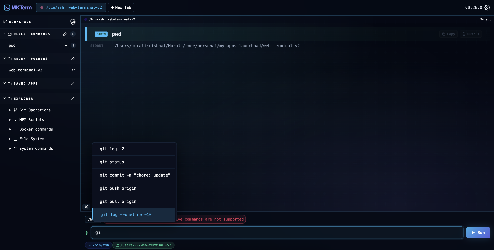

# MKTerm 🚀


**MKTerm** is a high-performance, web-based terminal interface designed for modern developers. 

It bridges the gap between the power of a native shell and the accessibility of a web UI, offering a rich command-line experience with enhanced visualization tools.

Check out our web site to other ways to install any more information 

[https://mkterm.web.app/](https://mkterm.web.app/)

You can check the mock demo that put together to play around [https://mkterm-demo.web.app/](https://mkterm-demo.web.app/)

## 🚀 Getting Started

### Installation

Install the CLI globally via npm:

```bash
npm install -g mkterm-cli
```

## Usage

Launch the terminal from any directory:
```bash
mkterm
```

## Some screenshots

### System commands


### Command suggestions



### Pipelines and apps


### Command meta


| Command |	Description |
| --------|-----------|
|/help |Lists all available system-level terminal commands.|
|/info	| Displays OS, CPU, GPU, and Node.js environment details.|
|/folder-tree| Displays file structure |
|/config	|Opens the terminal configuration panel. (WIP)|
|clear | Clear all terminal input and output|
|stop| Stops current shell |


<br>
<br>

## Latest Features
- **/folder-tree** - System command to display the folder structure in tree format.
- **pipelines/apps** - Run commands in multiple folder like frontend and backend.
- **Alias commands** - Use alias commands and send actual command to backend to execute, this is simple layer and not on OS level.


<br>
<br>

## ⚠️ Limitations
- TTY Support: Currently, TTY is not enabled. Highly interactive commands (like vim or top) won't work.
- Environment: Optimized for macOS (Darwin) and Linux.

### Built with ❤️ for the terminal-obsessed.
