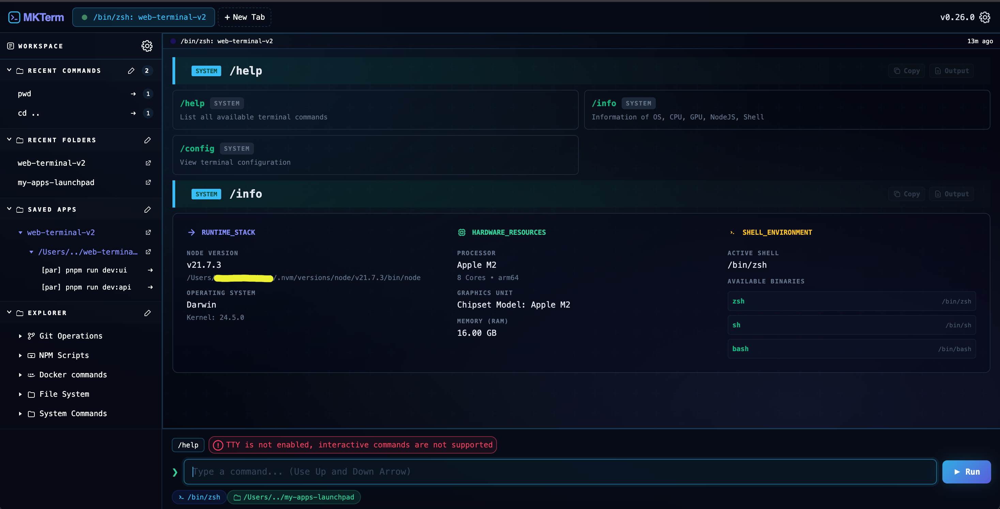
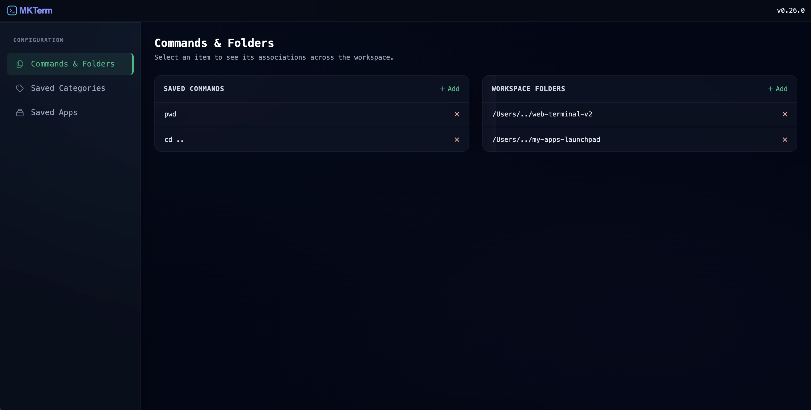
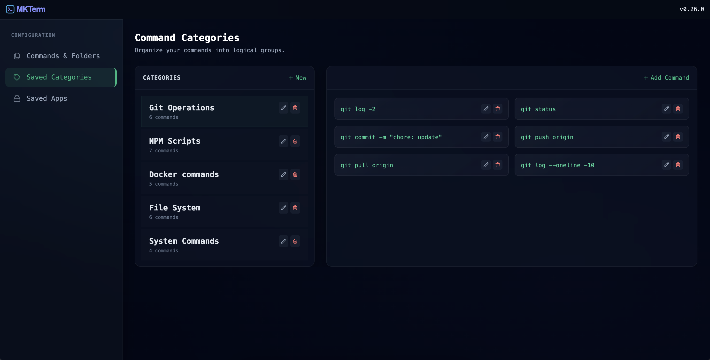
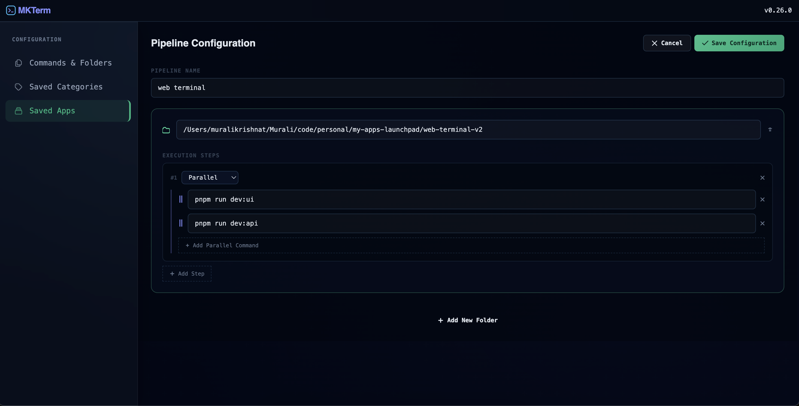
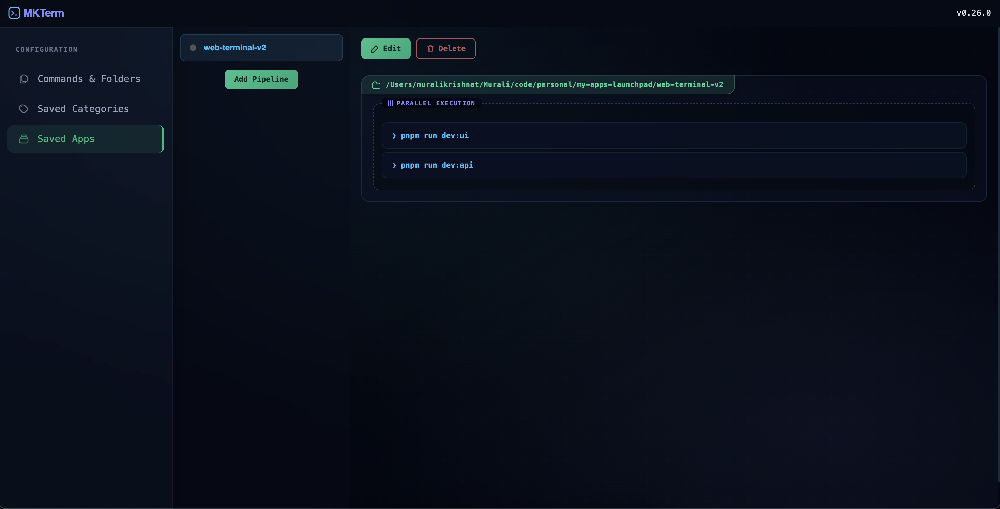
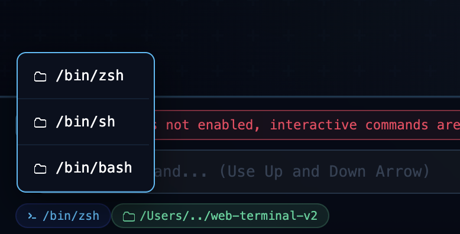
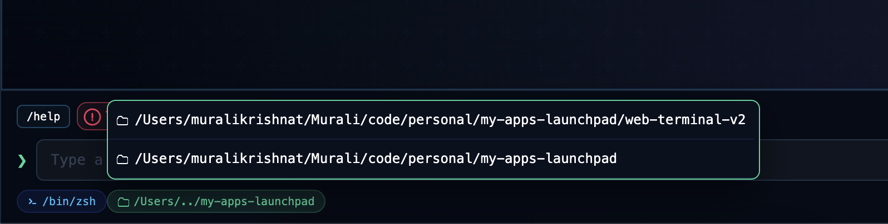

# MKTerm 🚀

**MKTerm** is a high-performance, web-based terminal interface designed for modern developers. 

It bridges the gap between the power of a native shell and the accessibility of a web UI, offering a rich command-line experience with enhanced visualization tools.


## 🚀 Getting Started

### Installation

Install the CLI globally via npm:

```bash
npm install -g mkterm
```

## Usage

Launch the terminal from any directory:
```bash
mkterm
```

## Some screenshots

### System commands


### Command suggestions


### Pipelines and apps








### Command meta





| Command |	Description |
| --------|-----------|
|/help |Lists all available system-level terminal commands.|
|/info	| Displays OS, CPU, GPU, and Node.js environment details.|
|/config	|Opens the terminal configuration panel. (WIP)|


## ⚠️ Limitations
- TTY Support: Currently, TTY is not enabled. Highly interactive commands (like vim or top) won't work.
- Environment: Optimized for macOS (Darwin) and Linux.

### Built with ❤️ for the terminal-obsessed.
